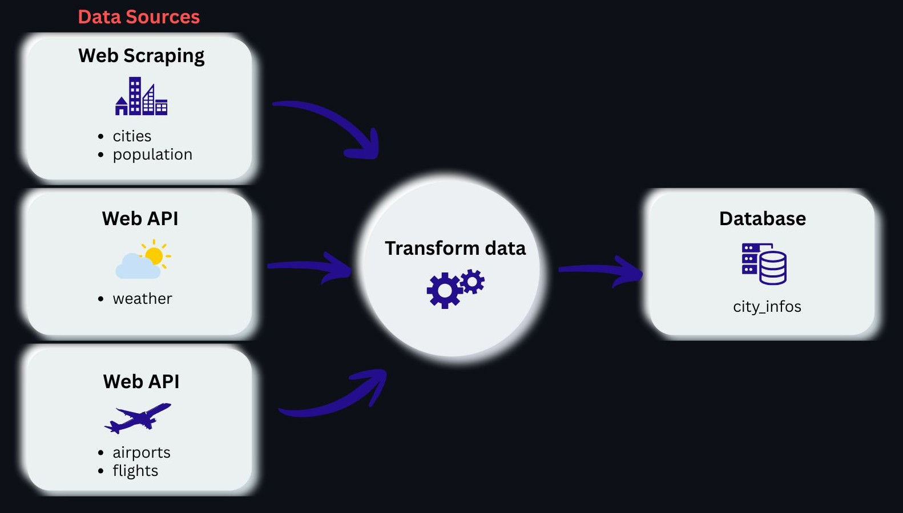
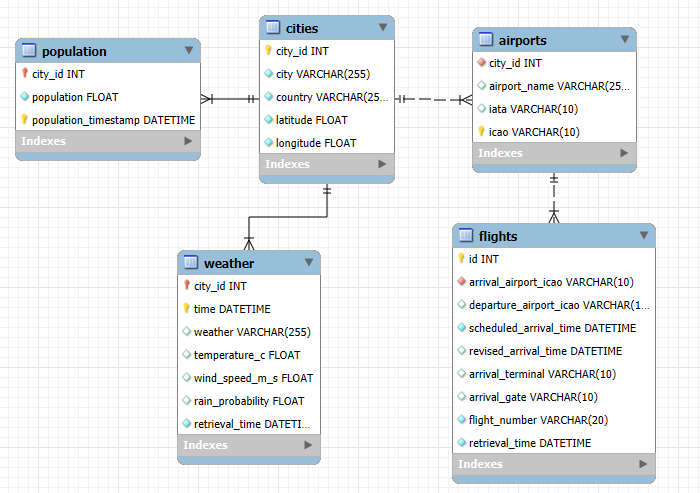

# 🧩 ETL Process for Multi-Source Data Collection and Database Creation

This project involves retrieving data from multiple web sources, performing data transformation, and storing the results in a MySQL database.

1. Create database structure — Define and set up the MySQL schema
2. Extract data
* Scrape city and population data from web
* Retrieve weather data from the OpenWeather API
* Retrieve airport and flights data from the AeroDataBox API
3. Transform data — Transform and format datasets for consistency and relational storage
4. Load data — Insert transformed data into the MySQL database

## Database Structure

The resulting database is organized into different dimension and fact tables.

## Repository Structure

<pre>
ETL_Weather_Flight/
├── images
├── .env.example
├── .gitignore
├── 00_Setup_Database.sql           # SQL file to create the database structure
├── 01_WebScraping_CitiesData.ipynb # Web scraping city data and sending data to database
├── 02_API_WeatherData.ipynb        # API call for weather data and sending data to database
├── 03_API_Flights.ipynb            # API call for flight data and sending data to database
├── README.md
└── environment.yml
</pre>
